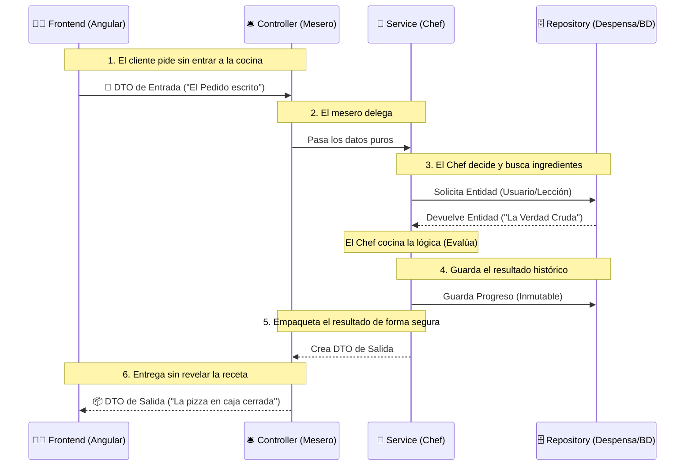

```mermaid
sequenceDiagram
participant F as 🧑‍💻 Frontend (Angular)
participant C as 🛎️ Controller (Mesero)
participant S as 🧠 Service (Chef)
participant R as 🗄️ Repository (Despensa/BD)

    Note over F,C: 1. El cliente pide sin entrar a la cocina
    F->>C: 📨 DTO de Entrada ("El Pedido escrito")

    Note over C,S: 2. El mesero delega
    C->>S: Pasa los datos puros

    Note over S,R: 3. El Chef decide y busca ingredientes
    S->>R: Solicita Entidad (Usuario/Lección)
    R-->>S: Devuelve Entidad ("La Verdad Cruda")

    Note over S: El Chef cocina la lógica (Evalúa)

    Note over S,R: 4. Guarda el resultado histórico
    S->>R: Guarda Progreso (Inmutable)

    Note over S,C: 5. Empaqueta el resultado de forma segura
    S-->>C: Crea DTO de Salida

    Note over C,F: 6. Entrega sin revelar la receta
    C-->>F: 📦 DTO de Salida ("La pizza en caja cerrada")
```