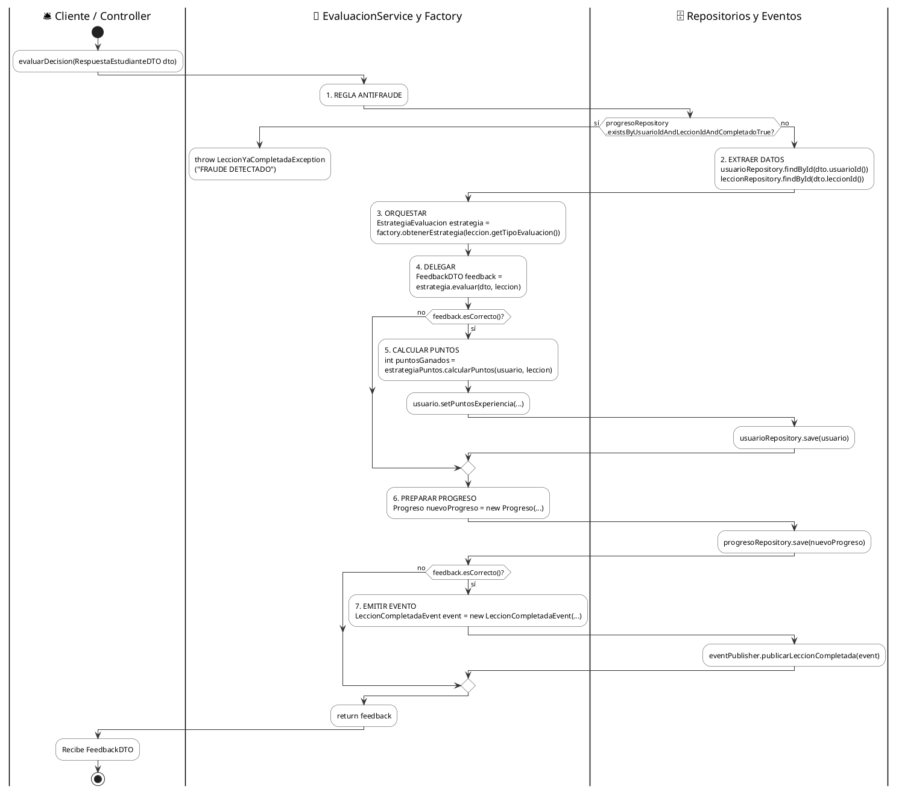

```plantuml
@startuml
skinparam ArchimateBackgroundColor #FFFFFF
skinparam ActivityBackgroundColor #FFFFFF
skinparam ActivityBorderColor #333333
skinparam ArrowColor #333333

|🛎️ Cliente / Controller|
start
:evaluarDecision(RespuestaEstudianteDTO dto);

|🧠 EvaluacionService y Factory|
:1. REGLA ANTIFRAUDE;

|🗄️ Repositorios y Eventos|
if (progresoRepository\n.existsByUsuarioIdAndLeccionIdAndCompletadoTrue?) then (sí)
|🧠 EvaluacionService y Factory|
:throw LeccionYaCompletadaException\n("FRAUDE DETECTADO");
|🛎️ Cliente / Controller|
detach
else (no)

    |🗄️ Repositorios y Eventos|
    :2. EXTRAER DATOS\nusuarioRepository.findById(dto.usuarioId())\nleccionRepository.findById(dto.leccionId());
    
    |🧠 EvaluacionService y Factory|
    :3. ORQUESTAR\nEstrategiaEvaluacion estrategia = \nfactory.obtenerEstrategia(leccion.getTipoEvaluacion());
    :4. DELEGAR\nFeedbackDTO feedback = \nestrategia.evaluar(dto, leccion);

    if (feedback.esCorrecto()?) then (sí)
        :5. CALCULAR PUNTOS\nint puntosGanados = \nestrategiaPuntos.calcularPuntos(usuario, leccion);
        :usuario.setPuntosExperiencia(...);
        
        |🗄️ Repositorios y Eventos|
        :usuarioRepository.save(usuario);
    else (no)
        |🧠 EvaluacionService y Factory|
    endif

    |🧠 EvaluacionService y Factory|
    :6. PREPARAR PROGRESO\nProgreso nuevoProgreso = new Progreso(...);

    |🗄️ Repositorios y Eventos|
    :progresoRepository.save(nuevoProgreso);

    |🧠 EvaluacionService y Factory|
    if (feedback.esCorrecto()?) then (sí)
        :7. EMITIR EVENTO\nLeccionCompletadaEvent event = new LeccionCompletadaEvent(...);
        
        |🗄️ Repositorios y Eventos|
        :eventPublisher.publicarLeccionCompletada(event);
    else (no)
        |🧠 EvaluacionService y Factory|
    endif

endif

|🧠 EvaluacionService y Factory|
:return feedback;

|🛎️ Cliente / Controller|
:Recibe FeedbackDTO;
stop
@enduml
```