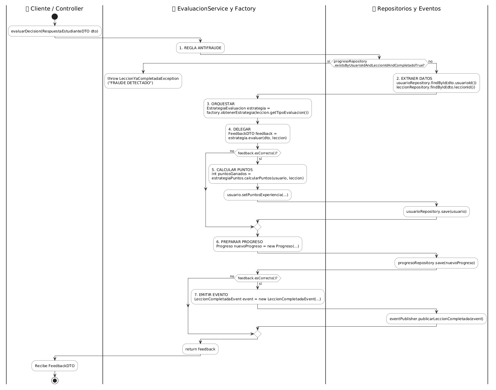

sequenceDiagram
participant C as 🛎️ Controller (Recepcionista)
participant S as 🧠 Service y Factory (Profesor Calificador)
participant R as 🗄️ Repositorios y Eventos (Registro)

    C->>S: 1. evaluarDecision(RespuestaEstudianteDTO)
    
    Note over S,R: 2. REGLA ANTIFRAUDE
    S->>R: ¿Existe progreso previo completado?
    R-->>S: Resultado de la búsqueda (verdadero/falso)

    alt Fraude Detectado (Verdadero)
        S-->>C: 🛑 throw LeccionYaCompletadaException
    else Evaluación Válida (Falso)
        Note over S,R: 3. EXTRAER DATOS
        S->>R: Solicita Entidades (Usuario, Lección)
        R-->>S: Devuelve Datos crudos
        
        Note over S: 4. ORQUESTAR Y DELEGAR
        S->>S: factory.obtenerEstrategia()
        S->>S: feedback = estrategia.evaluar()
        
        alt Respuesta Correcta
            Note over S,R: 5. CALCULAR PUNTOS
            S->>S: Incrementa XP del usuario
            S->>R: usuarioRepository.save()
        end
        
        Note over S,R: 6. PREPARAR Y GUARDAR PROGRESO
        S->>S: Crea nuevo objeto Progreso
        S->>R: progresoRepository.save()
        
        alt Respuesta Correcta
            Note over S,R: 7. EMITIR EVENTO
            S->>R: publicarLeccionCompletada(event)
        end
        
        Note over S,C: 8. EMPAQUETAR RESULTADO
        S-->>C: Devuelve FeedbackDTO
    end