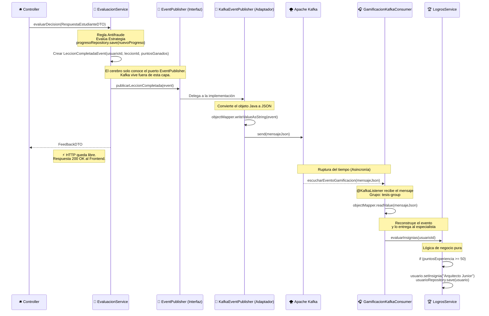

```mermaid
sequenceDiagram

    participant Controller as 🛎️ Controller
    participant Service as 🧠 EvaluacionService
    participant Interfaz as 🔌 EventPublisher (Interfaz)
    participant Adaptador as 🔌 KafkaEventPublisher (Adaptador)
    participant Kafka as 🌪️ Apache Kafka
    participant Consumer as 🎧 GamificacionKafkaConsumer
    participant Logros as 🏆 LogrosService

    Controller->>Service: evaluarDecision(RespuestaEstudianteDTO)

    Note over Service: Regla Antifraude<br/>Evalúa Estrategia<br/>progresoRepository.save(nuevoProgreso)

    Service->>Service: Crear LeccionCompletadaEvent(usuarioId, leccionId, puntosGanados)

    Note over Service,Interfaz: El cerebro solo conoce el puerto EventPublisher.<br/>Kafka vive fuera de esta capa.

    Service->>Interfaz: publicarLeccionCompletada(event)

    Interfaz->>Adaptador: Delega a la implementación

    Note over Adaptador: Convierte el objeto Java a JSON

    Adaptador->>Adaptador: objectMapper.writeValueAsString(event)

    Adaptador->>Kafka: send(mensajeJson)

    Service-->>Controller: FeedbackDTO

    Note left of Service: ⚡ HTTP queda libre.<br/>Respuesta 200 OK al Frontend.

    Note over Kafka,Consumer: Ruptura del tiempo (Asincronía)

    Kafka-->>Consumer: escucharEventoGamificacion(mensajeJson)

    Note over Consumer: @KafkaListener recibe el mensaje<br/>Grupo: tesis-group

    Consumer->>Consumer: objectMapper.readValue(mensajeJson)

    Note over Consumer,Logros: Reconstruye el evento<br/>y lo entrega al especialista

    Consumer->>Logros: evaluarInsignias(usuarioId)

    Note over Logros: Lógica de negocio pura

    Logros->>Logros: if (puntosExperiencia >= 50)

    Logros->>Logros: usuario.setInsignia("Arquitecto Junior")<br/>usuarioRepository.save(usuario)
```